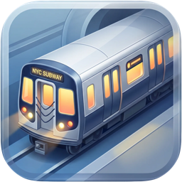

<p align="center">
  
</p>
<h1 align="center">SubwayBar</h1>
<p align="center">Real-time NYC subway arrivals in your menu bar.<br>
Click to see the next trains. No polling, no clutter.</p>
<p align="center"><strong>Version 1.0.0</strong> · macOS 13+ · Apple Silicon & Intel</p>
<p align="center"><a href="https://github.com/madebysan/subway-bar/releases/latest"><strong>Download SubwayBar</strong></a></p>

---

## What it does

SubwayBar sits in your macOS menu bar as a colored subway bullet icon. Click it to instantly see:

- **Next trains** at your station with live countdowns
- **Service alerts** for your line (delays, planned work)
- **"Leave now!"** indicator based on your walking time to the station

Data comes directly from the MTA's free GTFS-Realtime feeds — the same source that powers the countdown clocks in stations.

## Features

- **Every NYC subway line** — 1/2/3, 4/5/6, 7, A/C/E, B/D/F/M, G, J/Z, L, N/Q/R/W, S
- **All ~496 stations** — searchable picker, filtered by line
- **On-demand refresh** — fetches fresh data every time you open the menu (no background polling, no battery drain)
- **Walking time** — set how many minutes you are from the station; trains you can still catch are highlighted
- **Service alerts** — live delay and planned work notifications for your line
- **Native macOS** — lightweight, follows system dark/light mode, no Electron

## Setup

1. Open SubwayBar — the icon appears in your menu bar
2. Click the gear icon to open settings
3. Pick your subway line → direction → station
4. Set your walking time (optional)
5. Click the icon anytime to see live arrivals

## Install

### Download (recommended)

1. Download `SubwayBar.dmg` from the [latest release](https://github.com/madebysan/subway-bar/releases/latest)
2. Open the DMG and drag SubwayBar to Applications
3. Launch from Applications (right-click → Open on first launch if needed)

### Build from source

```bash
git clone https://github.com/madebysan/subway-bar.git
cd subway-bar
swift build -c release
# The binary is at .build/release/SubwayBar
```

## Tech Stack

- Swift 6 + SwiftUI (MenuBarExtra)
- Apple swift-protobuf for GTFS-RT parsing
- MTA GTFS-Realtime feeds (free, no API key)
- Swift Package Manager

## Data Source

All train arrival data comes from the [MTA's GTFS-Realtime feeds](https://api.mta.info/), which are free and require no API key. The app fetches data on-demand when you click the menu bar icon — no background polling.

## License

MIT — see [LICENSE](LICENSE)

---

Made by [santiagoalonso.com](https://santiagoalonso.com)
