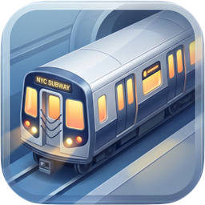
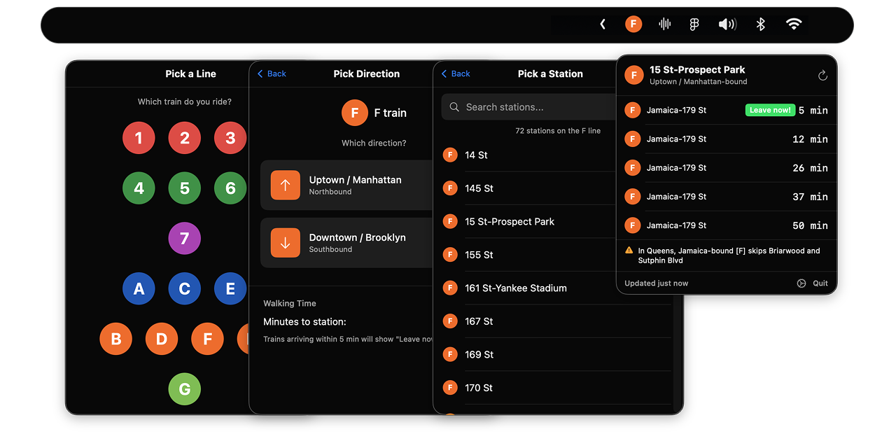

<p></p>

<h1>Arrival</h1>

<p>Real-time NYC subway arrivals in your menu bar.<br>
Never miss your train.</p>

<p><strong>Version 1.0.1</strong> · macOS 13+ · Apple Silicon & Intel</p>

<p>
  
  
  
</p>

<p><a href="https://github.com/madebysan/arrival/releases/latest">Download Arrival</a> · <a href="https://github.com/madebysan/arrival-ios">iOS version</a></p>



I commute the same route every day. The only thing I actually need is when is the next train at my stop, on my line, going my direction. Colored subway bullet in the menu bar. Click it, see the next trains. Close it, back to work.


## What it does

Arrival sits in the menu bar as a colored subway-bullet icon. Click it and you see, instantly:

- **Next trains** at your station with live countdowns
- **Service alerts** for your line (delays, planned work)
- **"Leave now!"** indicator based on your walking time to the station

Data comes directly from the MTA's free GTFS-Realtime feeds, the same source that powers the countdown clocks in stations.

## Features

- **Every NYC subway line.** 1/2/3, 4/5/6, 7, A/C/E, B/D/F/M, G, J/Z, L, N/Q/R/W, S
- **All ~496 stations.** Searchable picker, filtered by line
- **On-demand refresh.** Fetches fresh data every time you open the menu. No background polling, no battery drain.
- **Walking time.** Set how many minutes you are from the station. Trains you can still catch are highlighted.
- **Service alerts.** Live delay and planned-work notifications for your line.
- **Native macOS.** Lightweight, follows system appearance, no Electron.

## Setup

1. Open Arrival. The icon appears in your menu bar.
2. Click the gear icon to open settings
3. Pick your subway line → direction → station
4. Set your walking time (optional)
5. Click the icon anytime to see live arrivals

## Install

### Download (recommended)

1. Download `Arrival.dmg` from the [latest release](https://github.com/madebysan/arrival/releases/latest)
2. Open the DMG and drag Arrival to Applications
3. Launch from Applications (right-click → Open on first launch if needed)

### Build from source

```bash
git clone https://github.com/madebysan/arrival.git
cd arrival
swift build -c release
# Binary at .build/release/Arrival
```

## Known issues

- **v1.0.1 DMG launch crash on some machines.** Likely a bundle-ID resource path issue from the `SubwayBar → Arrival` rename (`Arrival_Arrival.bundle`). The build-from-source instructions above work reliably. A fixed DMG is a rebuild away but isn't currently scheduled.

## Tech stack

- Swift 6 + SwiftUI (`MenuBarExtra`)
- Apple `swift-protobuf` for GTFS-RT parsing
- MTA GTFS-Realtime feeds (free, no API key)
- Swift Package Manager

## Data source

All train-arrival data comes from the [MTA's GTFS-Realtime feeds](https://api.mta.info/), which are free and require no API key. The app fetches data on-demand when you click the menu-bar icon. No background polling.

## License

[MIT](LICENSE)

---

Made by [santiagoalonso.com](https://santiagoalonso.com)
